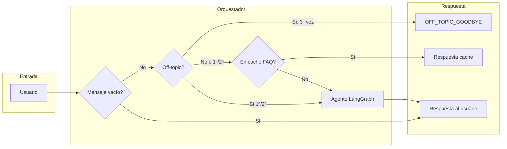
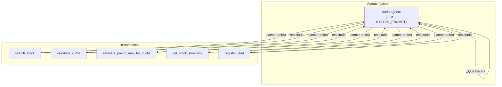
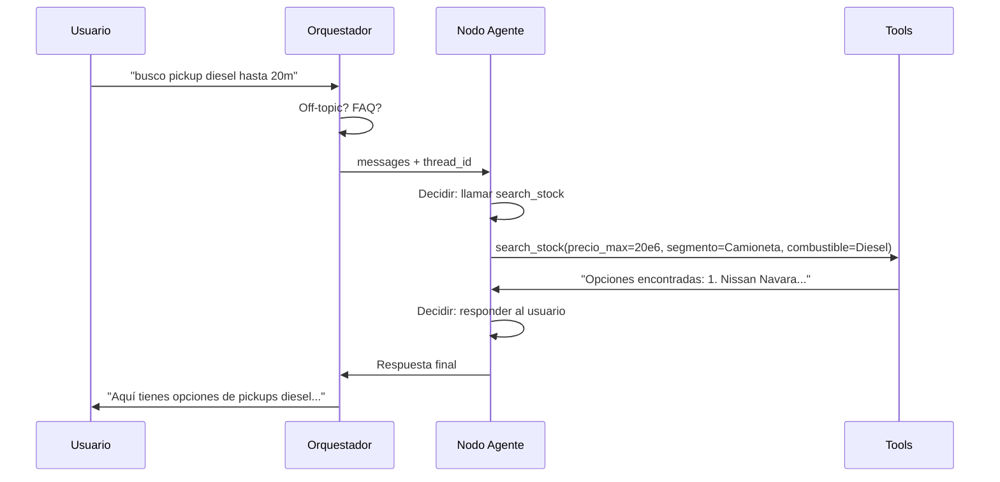

# Contexto del agente: nodos y tools

## 0. Nodos del grafo (LangGraph create_react_agent)

En este proyecto el agente se construye con `create_react_agent(llm, tools, prompt, checkpointer)`. Ese grafo tiene de forma interna nodos como:

| Nodo | Rol |
|------|-----|
| **__start__** | Entrada: mensajes del usuario (y historial por thread_id). |
| **agent** | LLM (Jaime) con el SYSTEM_PROMPT; decide si responde al usuario o llama a tools. |
| **tools** | Ejecuta la tool que el agente eligió (search_stock, calculate_cuota, etc.). |
| **__end__** | Salida: mensajes finales (respuesta de Jaime al usuario). |

El flujo es: `__start__` → `agent` → (si llama tool) → `tools` → `agent` → … hasta que `agent` devuelve respuesta para el usuario → `__end__`.

---

## 1. Flujo completo (desde el mensaje del usuario hasta la respuesta)

---

## 2. Dentro del agente (ReAct: nodo agente + tools)

LangGraph usa `create_react_agent`: un **nodo agente** (LLM + prompt) que en cada turno puede **responder al usuario** o **llamar una o más tools**. Tras ejecutar las tools, el resultado vuelve al agente hasta que decide dar la respuesta final.

---

## 3. Detalle de cada tool

| Tool | Uso típico |
|------|-------------|
| **search_stock** | Buscar vehículos por precio_min/max, año, km, marca, modelo, **segmento** (CityCar, Suv, Sedan, Camioneta, Furgon), **transmision** (Automatico/Mecanico), **combustible** (Diesel, Gasolina, Hibrido, Electrico), **exclude_marca**, **exclude_modelo**, **exclude_combustible**. Devuelve texto con opciones + versión + link. |
| **calculate_cuota** | Dado precio_lista, pie y plazo (24/36/48), calcula la cuota mensual (pie se ajusta 30–50%). |
| **estimate_precio_max_for_cuota** | Dado pie, cuota_deseada y plazo, devuelve el precio máximo de auto que podría pagar; luego se usa en search_stock(precio_max=...). |
| **get_stock_summary** | Resumen: cantidad total de vehículos y rangos de precios/años. |
| **register_lead** | Registrar lead (nombre, RUT, correo, patente/km VPP, notas) para que un ejecutivo contacte. |

---

## 4. Vista simplificada del flujo ReAct (paso a paso)

---

## 5. Memoria y orquestador

| Componente | Función |
|------------|--------|
| **Checkpointer** (SQLite o Postgres) | Persiste el estado del agente por `thread_id`: historial de mensajes y de llamadas a tools, para seguir la conversación. |
| **Orquestador** | Recibe el mensaje del usuario; aplica reglas off-topic (sin mensaje genérico; solo despedida a la 3ª); consulta FAQ cache; invoca al agente; devuelve la respuesta. |
| **FAQ cache** | Si la pregunta exacta ya fue respondida, devuelve la respuesta cacheada sin llamar al agente. |

---

Para ver los diagramas Mermaid renderizados puedes abrir este `.md` en GitHub, en VS Code con extensión Mermaid, o en [mermaid.live](https://mermaid.live).
